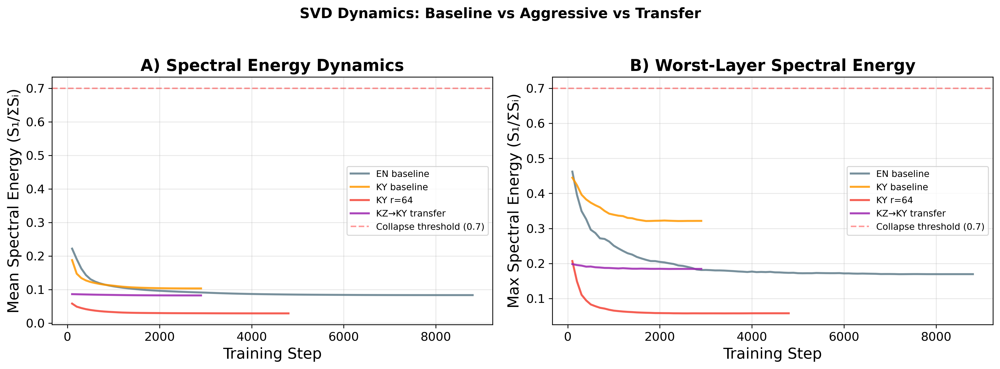
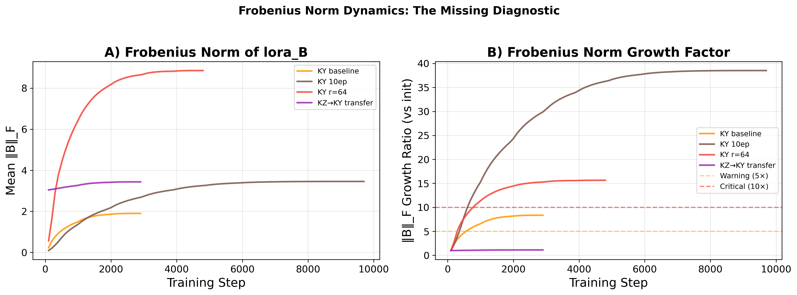
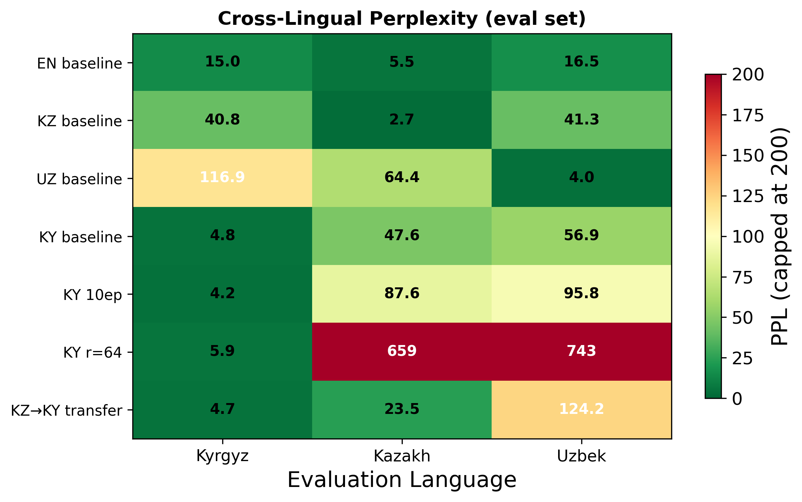
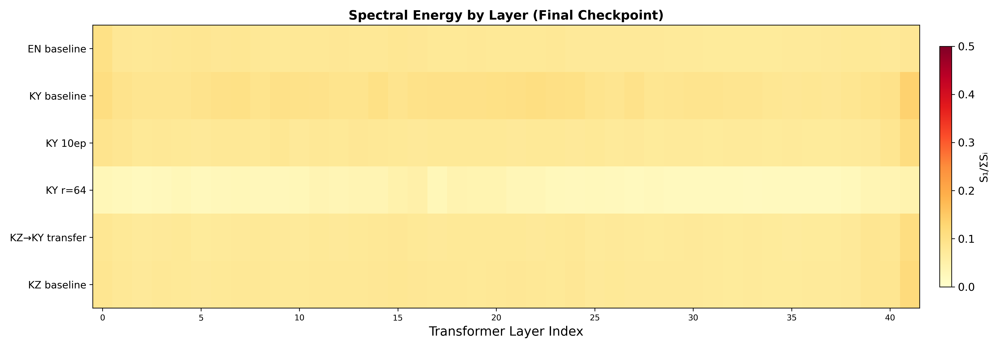
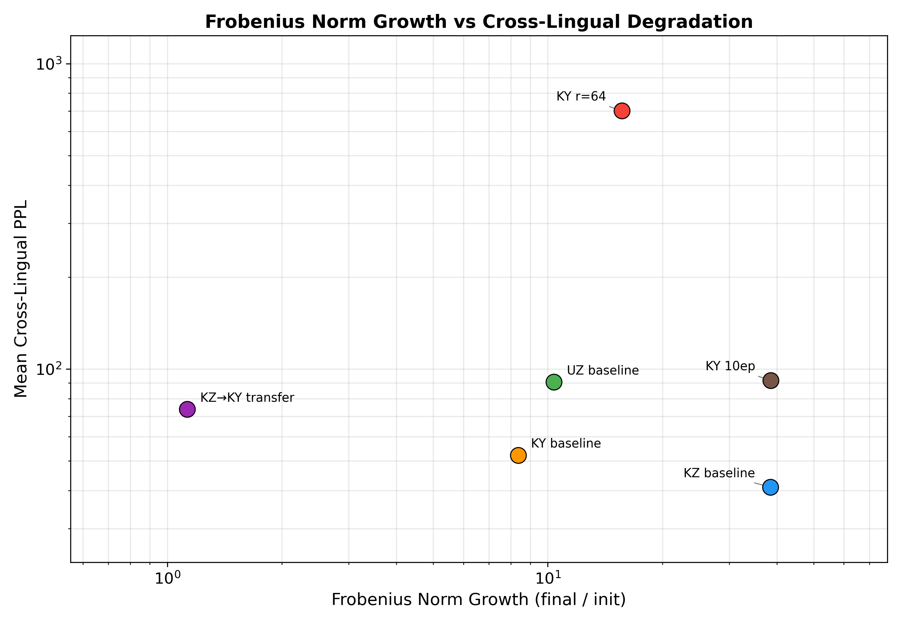
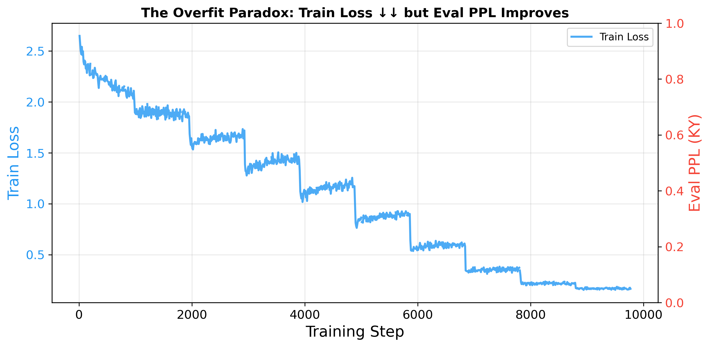
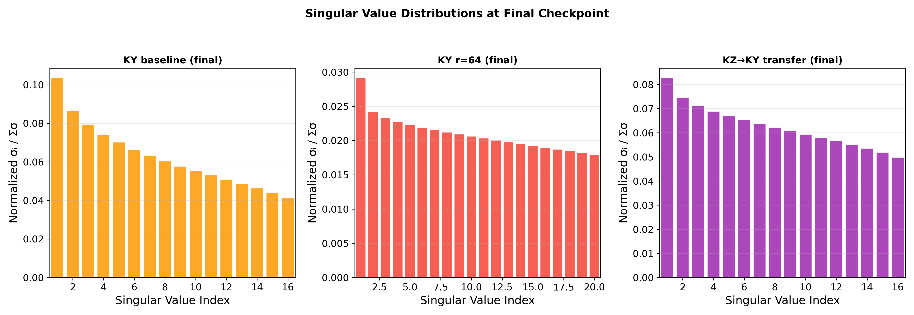
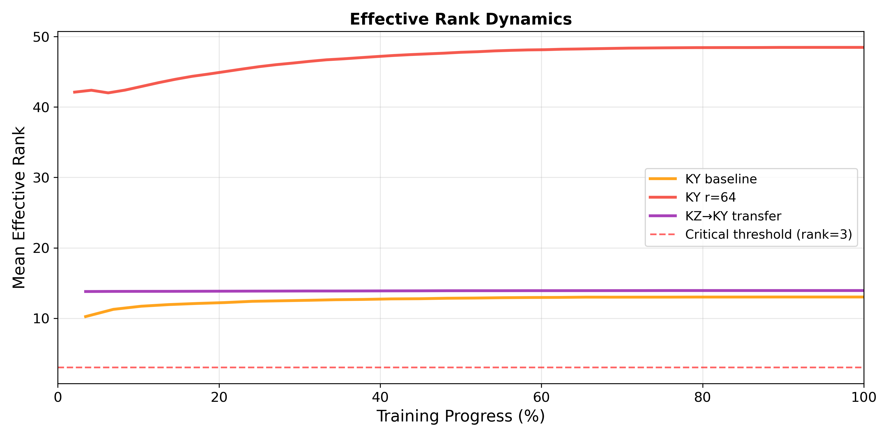

# Spectral Collapse Without Collapse

**SVD Dynamics of LoRA Adapters for Low-Resource Turkic Languages**

> Anonymous submission — code and experimental artifacts for reproducibility review

---

## Key Findings

We fine-tune **Gemma-2-9B** (4-bit QLoRA) on three Turkic languages and monitor LoRA adapter spectral dynamics via SVD. Three principal results:

1. **Spectral energy threshold does not hold.** No experiment exceeds SE = 0.59 (well below the proposed 0.7 threshold), yet r=64 configurations suffer complete functional collapse (NER F1 = 0, cross-lingual PPL > 600).

2. **Frobenius norm growth as diagnostic.** Pathological configurations exhibit 15–38x norm growth vs. 1.13x for the best transfer setup.

3. **Cross-lingual transfer works.** Kazakh → Kyrgyz sequential transfer yields +61% NER F1 improvement (0.253 vs. 0.157) while retaining Kazakh knowledge (PPL 23.5 vs. 47.6).

---

## Results at a Glance

| Experiment | Target PPL | NER F1 (KY) | KZ PPL | Frob. Growth |
|:-----------|:----------:|:-----------:|:------:|:------------:|
| E1 · KZ Baseline | 2.73 | 0.219 | 2.73 | 38.5x |
| E2 · UZ Baseline | 4.03 | 0.138 | 64.44 | — |
| E3 · KY Baseline | 4.78 | 0.157 | 47.58 | 8.36x |
| E4 · KY Overfit (10ep) | 4.18 | 0.173 | 87.65 | — |
| E5 · KY r=64 | 5.90 | 0.000 | 659.25 | 15.6x |
| E6 · KZ→KY Transfer | 4.73 | **0.253** | **23.49** | **1.13x** |
| E8 · EN Control | 5.54 | 0.209 | 5.54 | 33.4x |

---

## Spectral Energy Dynamics

Spectral energy never approaches the proposed 0.7 collapse threshold. The r=64 configuration shows **decreasing** SE despite suffering complete functional collapse.

<p align="center">
  
</p>

---

## Frobenius Norm: The Missing Diagnostic

Frobenius norm growth reliably separates healthy from pathological training regimes within underrepresented languages. The transfer experiment begins at the KZ baseline's final norm and shows minimal additional growth.

<p align="center">
  
</p>

---

## Cross-Lingual Perplexity

The heatmap reveals catastrophic forgetting patterns. The r=64 row is clearly pathological, while the KZ→KY transfer shows the most balanced profile.

<p align="center">
  
</p>

---

## Layer-wise Spectral Energy

No individual layer in any experiment exceeds the 0.7 threshold — even in configurations with complete functional collapse.

<p align="center">
  
</p>

---

## Frobenius Norm vs. Cross-Lingual Degradation

Higher norm growth is associated with more severe catastrophic forgetting. The EN control is a clear outlier — well-represented languages absorb large perturbations without degradation.

<p align="center">
  
</p>

---

## The Overfit Paradox

Extended training (10 epochs) improves target-language PPL but severely degrades cross-lingual knowledge — a regime of "useful overfitting."

<p align="center">
  
</p>

---

## Singular Value Distributions

The r=64 configuration develops a well-distributed spectrum (low SE) with dramatically larger absolute magnitudes — explaining why SE fails as a diagnostic.

<p align="center">
  
</p>

---

## Effective Rank Dynamics

The r=64 configuration shows increasing effective rank despite functional degradation — further evidence that standard spectral metrics can be misleading.

<p align="center">
  
</p>

---

## Subword Fragmentation

| Language | Tokens/Word | vs. English |
|----------|:-----------:|:-----------:|
| English  | 1.15 | 1.00x |
| Uzbek    | 3.68 | 3.20x |
| Kyrgyz   | 3.69 | 3.21x |
| Kazakh   | 3.74 | 3.25x |

Turkic languages require ~3.2x more tokens per word, reflecting severe tokenizer mismatch for agglutinative morphology.

---

## Experimental Setup

| Component | Details |
|-----------|---------|
| Base Model | Gemma-2-9B (4-bit NF4, bfloat16) |
| LoRA | Rank 16/64, α=2r, 7 target modules per layer |
| Data | ~150 MB per language (KY, KZ, UZ, EN) |
| SVD Monitor | Every 100 steps: SE, effective rank, stable rank, entropy, Frobenius norm |
| Evaluation | Perplexity, WikiANN NER (3-shot), TUMLU QA (5-shot) |
| Hardware | NVIDIA RTX 5080 (16 GB) |

---

## Repository Structure

```
├── scripts/
│   ├── train_svd.py            # Training with SVD monitoring callback
│   ├── evaluate.py             # Post-training evaluation (PPL, NER, TUMLU)
│   ├── plot_final.py           # Publication-quality figure generation
│   ├── prepare_kz_uz_data.py   # Kazakh & Uzbek data preparation
│   ├── rebuild_uzbek.py        # Uzbek corpus construction
│   └── analyze_datasets.py     # Dataset statistics & tokenization analysis
├── figures/                    # All 9 publication figures
├── experiments/                # Training logs & evaluation results
│   ├── E1_kz_baseline/         # Kazakh baseline (r=16, lr=2e-4, 3ep)
│   ├── E2_uz_baseline/         # Uzbek baseline
│   ├── E3_ky_baseline/         # Kyrgyz baseline
│   ├── E4_ky_overfit/          # Kyrgyz overfit (10 epochs)
│   ├── E5_ky_r64/              # Kyrgyz r=64 (functional collapse)
│   ├── E6_kz_ky_transfer/      # Kazakh → Kyrgyz transfer
│   ├── E7_diverged/            # Diverged (r=64, lr=1e-3)
│   └── E8_en_control/          # English control
├── requirements.txt
└── README.md
```

---

## Quick Start

```bash
pip install -r requirements.txt

# Train with SVD monitoring
python scripts/train_svd.py \
    --lang ky \
    --data_path data/ky_corpus.jsonl \
    --output_dir experiments/E3_ky_baseline \
    --rank 16 --lr 2e-4 --epochs 3

# Evaluate trained adapter
python scripts/evaluate.py \
    --adapter_path experiments/E3_ky_baseline/final_adapter

# Reproduce all figures from logs
python scripts/plot_final.py
```

---

## Data Sources

Training corpora (~150 MB each) are not included due to size. They can be reconstructed from:

| Language | Source | Records | Tokens |
|----------|--------|:-------:|:------:|
| Kazakh | Kazakh Wikipedia + sozkz-corpus | 61,879 | 14.1M |
| Kyrgyz | Curated local corpus (literature, history, encyclopedic) | 17,360 | 4.4M |
| Uzbek | uz-books + Uzbek Wikipedia + FineWeb-2 (Cyrillic) | 21,242 | 5.4M |
| English | English Wikipedia | 52,268 | 12.7M |

> Note: The Kyrgyz corpus cannot be redistributed due to licensing restrictions on source materials.

---

## License

MIT License. For academic research purposes.
